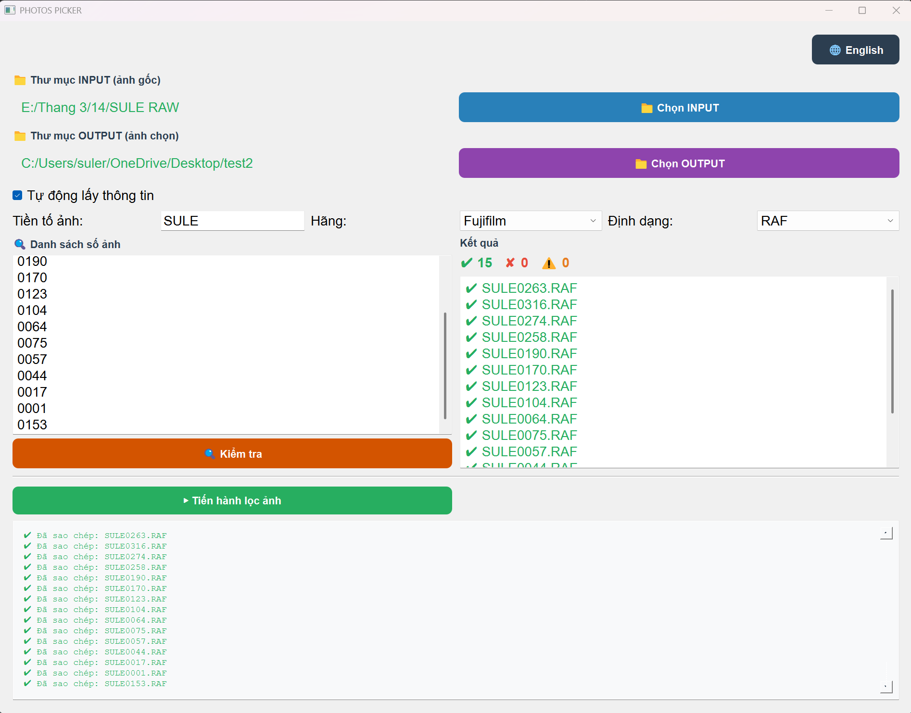

# Photos Picker

**Helping photographers quickly select and copy the right photos from customer lists.**

As a photographer and developer, I understand how frustrating and time-consuming it is to manually sort through hundreds of photos to find the ones a customer wants. Photos Picker automates this process with a simple, intuitive interface.

## ✨ Key Features

- 📸 **Smart Photo Selection** - Enter photo numbers, app finds and validates them
- 🌐 **Bilingual UI** - English & Vietnamese with one-click switching
- 🖥️ **Cross-Platform** - Works on Windows, macOS, and Linux
- 💾 **Batch Processing** - Handle multiple customers in one session
- 🎨 **Professional Interface** - Clean, intuitive design
- ⚡ **Fast & Reliable** - Preserves metadata, detects duplicates
- 💾 **Settings Persistence** - App remembers your preferences

## 📚 Documentation

### User Guides 
- **[MANUAL_EN.md](MANUAL_EN.md)** - Complete user guide in English
  - Installation, step-by-step usage, troubleshooting, tips & tricks

- **[MANUAL_VI.md](MANUAL_VI.md)** - Hướng dẫn chi tiết bằng Tiếng Việt
  - Cài đặt, hướng dẫn từng bước, xử lý sự cố, mẹo & thủ thuật

### Developer Guides
- **[CLAUDE.md](CLAUDE.md)** - Architecture overview for developers
- **[EXPORT_GUIDE.md](EXPORT_GUIDE.md)** - Building and distributing the app
- **[MACOS_BUILD.md](MACOS_BUILD.md)** - Detailed macOS build instructions

## 🚀 Quick Start

### Windows
```bash
# Extract and run
Photos Picker.exe
```

### macOS
```bash
# Extract, then double-click
Photos Picker.app
```

### Linux
```bash
./Photos\ Picker
```

## 📖 How It Works (Quick Overview)

1. **Select Folders**
   - INPUT: Where your original photos are stored
   - OUTPUT: Where selected photos will be copied

2. **Set Photo Parameters**
   - Prefix (e.g., DSCF)
   - Camera brand (Canon, Nikon, Fujifilm, etc.)
   - File format (RAF, NEF, CR3, JPG, etc.)

3. **Enter Photo Numbers**
   - Paste or type photo numbers
   - One number per line

4. **Check & Copy**
   - Click "Check" to validate
   - Click "Start" to copy selected photos

**[→ Read Full User Guide](MANUAL_EN.md)** or **[→ Đọc Hướng Dẫn Đầy Đủ](MANUAL_VI.md)**

## 🛠️ Building from Source

### Development Setup
```bash
# Create virtual environment
python -m venv venv
source venv/bin/activate  # On Windows: venv\Scripts\activate

# Install dependencies
pip install PyQt5 pyinstaller pillow
```

### Build Executables
```bash
# Cross-platform build
python build.py              # Current platform
python build.py --all        # All platforms
python build.py --windows    # Windows only
python build.py --macos      # macOS only

# Manual PyInstaller
pyinstaller "Photos Picker.spec"          # Windows
pyinstaller Photos_Picker_macOS.spec      # macOS
```

**[→ Detailed Build Instructions](EXPORT_GUIDE.md)**

## 📦 Installation Options

### Pre-Built Executables
- Download `Photos_Picker_Windows.zip` for Windows
- Download `Photos_Picker_macOS.zip` for macOS
- Extract and run

### From Source
- Requires Python 3.8+
- Install dependencies with pip
- Run `python photos_picker.py`

## 📋 System Requirements

| Platform | Minimum | Recommended |
|----------|---------|-------------|
| Windows | 7+, 500MB | 10/11, 2GB RAM |
| macOS | 10.13+, 500MB | 11+, 2GB RAM |
| Linux | Ubuntu 18.04+, 500MB | Ubuntu 20.04+, 2GB RAM |

## 🎯 Supported Camera Brands

Canon, Nikon, Sony, Fujifilm, Panasonic, Olympus, Pentax, Leica, Hasselblad, GoPro, Phase One, Red, Sigma, Blackmagic

[Full format list in user manual](MANUAL_EN.md#features-explained)

## 🌍 Languages

- ✅ **English** (EN)
- ✅ **Vietnamese** (VI)
- Switch anytime with the 🌐 button

## 💡 Tips

- **Copy-paste photo numbers from Excel/Sheets** - Works seamlessly
- **Duplicate detection** - Prevents copying the same photo twice
- **Metadata preservation** - Original photo dates and EXIF data preserved
- **Batch processing** - Handle multiple customers quickly
- **Settings saved** - App remembers your preferences next time

## 🐛 Troubleshooting

**App won't run?**
- See [MANUAL_EN.md Troubleshooting](MANUAL_EN.md#troubleshooting)

**macOS Gatekeeper error?**
```bash
xattr -d com.apple.quarantine "Photos Picker.app"
```

**Build issues?**
- See [EXPORT_GUIDE.md](EXPORT_GUIDE.md)

## 📁 Project Structure

```
Photos-Picker/
├── photos_picker.py          # Main entry point
├── ui/main_window.py         # GUI with language support
├── core/service.py           # Photo picker logic
├── core/worker.py            # File operations
├── build.py                  # Build script
├── MANUAL_EN.md              # English user guide
├── MANUAL_VI.md              # Vietnamese user guide
├── EXPORT_GUIDE.md           # Distribution guide
└── MACOS_BUILD.md            # macOS build guide
```

## 📈 Version Info

- **Current Version**: 1.0.0
- **Last Updated**: March 2026
- **Platforms**: Windows, macOS, Linux
- **Languages**: English, Vietnamese

## 📝 License

Photos Picker is provided as-is for personal and professional use.

## 💬 Feedback

Found a bug? Have a suggestion? Please let me know!

---

**For detailed instructions, read [MANUAL_EN.md](MANUAL_EN.md) or [MANUAL_VI.md](MANUAL_VI.md)**
